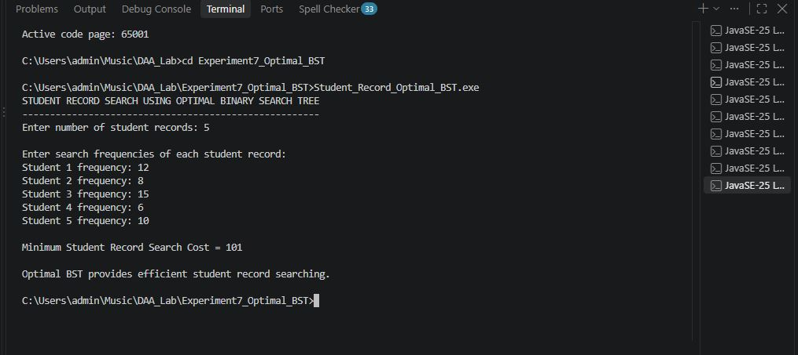
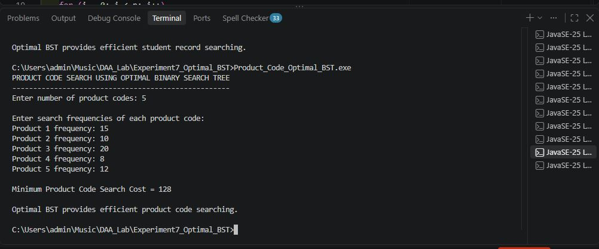

# Experiment No. 7 — Optimal Binary Search Trees Using Dynamic Programming

## Aim

To implement an **Optimal Binary Search Tree (OBST)** using **Dynamic Programming** and minimize the total search cost.

## Objective

* To understand the concept of Optimal Binary Search Tree.
* To implement OBST using Dynamic Programming.
* To minimize the expected search cost.
* To understand the practical applications of OBST.

## Theory

An **Optimal Binary Search Tree** is a Binary Search Tree arranged in such a way that the total search cost is minimum.

The search frequency of each key is considered while constructing the tree.

Dynamic Programming is used to calculate the minimum search cost for different ranges of keys and obtain the optimal solution.

### Dynamic Programming Formula

For a range of keys from `i` to `j`:

`Cost[i][j] = Minimum(Cost[i][k-1] + Cost[k+1][j] + Sum of Frequencies)`

where `k` is selected as the root of the current subtree.

## Applications

### 1. Dictionary Word Search

An Optimal BST can be used to arrange frequently searched dictionary words so that common words can be found faster.

**C File:** `Dictionary_Word_Optimal_BST.c`

**Output:**

### 2. Student Record Search

An Optimal BST can be used to organize student records based on their search frequencies for faster record retrieval.

**C File:** `Student_Record_Optimal_BST.c`

**Output:**

### 3. Product Code Search

An Optimal BST can be used in product databases to arrange frequently searched product codes for efficient searching.

**C File:** `Product_Code_Optimal_BST.c`

**Output:**

## Algorithm

1. Read the number of keys.
2. Read the search frequency of each key.
3. Initialize the cost table for individual keys.
4. Calculate the total frequency for each range of keys.
5. Consider every key as the root of the current range.
6. Calculate the cost of left and right subtrees.
7. Select the minimum cost.
8. Continue until all ranges are processed.
9. Display the minimum search cost.

## Time Complexity

**O(n³)**

## Space Complexity

**O(n²)**

## Advantages

* Reduces the average search cost.
* Useful when some keys are searched more frequently.
* Provides an optimized Binary Search Tree.
* Dynamic Programming avoids repeated calculations.

## Limitations

* Frequencies should be known or estimated.
* Construction requires additional memory.
* It is less useful when search frequencies change frequently.

## Technologies Used

* Programming Language: **C**
* Algorithm Technique: **Dynamic Programming**
* IDE: **Visual Studio Code**
* Compiler: **GCC**
* Version Control: **Git and GitHub**

## Conclusion

Thus, the **Optimal Binary Search Tree** was implemented using **Dynamic Programming**. The algorithm finds the minimum search cost by considering different possible roots and selecting the optimal arrangement. The concept was demonstrated using dictionary search, student record search, and product code search applications.
